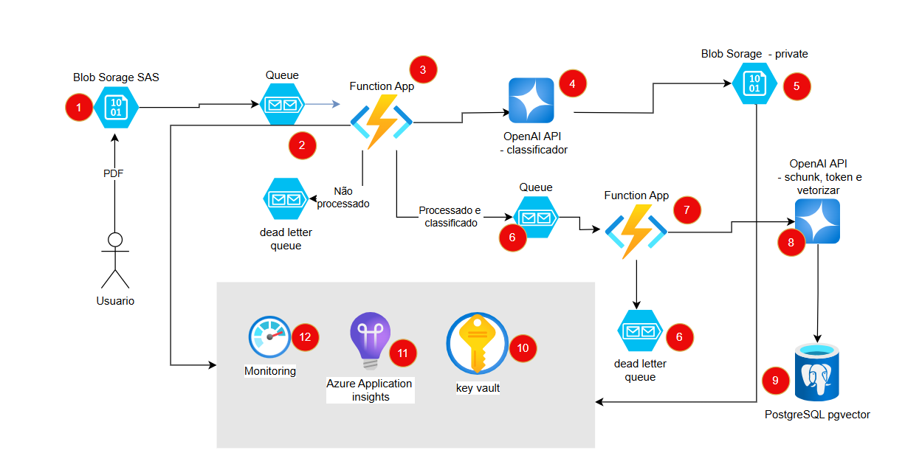

# Projeto de Processamento e Classificação de Documentos

Este projeto implementa uma arquitetura na Azure para processar, classificar e armazenar documentos PDF. Utiliza vários serviços da Azure, incluindo Azure Functions, Azure Storage, Azure Queue Storage, OpenAI API e PostgreSQL com a extensão `pgvector`.

## Arquitetura

A arquitetura do projeto é composta pelos seguintes componentes:

1. **Azure Storage (Blob Storage)**: Recebe os PDFs enviados via SAS.
2. **Azure Queue Storage (Fila Inicial)**: Enfileira as mensagens de processamento dos PDFs. Caso de erro, ele envia o arquivo para Dead letter queue
3. **Azure Function (Classificação)**: Processa as mensagens da fila inicial, classifica os documentos usando a API do OpenAI e enfileira o arquivo em uma nova fila para processamento adicional.
4. **OpenAI API**: Modelo para classificação de documentos.
5. **Blob storage**: armazenamento do pdf classificado conforme a categoria na pasta correta
6. **Azure Queue Storage (Fila de Processamento)**: Enfileira as mensagens para processamento adicional. **Dead Letter Queue**: Armazena mensagens que falharem no processamento adicional.
7. **Azure Function (Tokenização e Vetorização)**: Processa as mensagens da fila de processamento, transforma o texto em tokens e vetores, e armazena os vetores no banco de dados PostgreSQL com `pgvector`.
8. **OpenAI API**: modelo para fazer o embedding do texto em pdf.
9. **Azure Database for PostgreSQL com pgvector**: Armazena os vetores para pesquisa futura.
10. **Azure Key Vault**: Gerencia e protege chaves de criptografia, segredos e certificados.
11. **Azure Application Insights**: Monitora o desempenho e a saúde do serviço.
12. **Azure Monitoring**: monitoamento geral de metricas do explorer e log analytics

## Fluxo de Trabalho

1. **Recebimento do PDF**: O PDF é enviado para o Azure Storage (Blob Storage) via SAS.
2. **Enfileiramento da Requisição Inicial**: Um trigger no Azure Storage envia uma mensagem para o Azure Queue Storage (Fila Inicial).
3. **Processamento da Fila Inicial**: A Azure Function (Classificação) é acionada para processar a mensagem da fila inicial.
4. **Classificação do Documento**: A Azure Function (Classificação) utiliza a API do OpenAI para classificar o documento.
5. **Enfileiramento para Processamento Adicional**: O arquivo classificado é enfileirado no Azure Queue Storage (Fila de Processamento).
6. **Processamento da Fila de Processamento**: A Azure Function (Tokenização e Vetorização) é acionada para processar a mensagem da fila de processamento.
7. **Tokenização e Vetorização**: A Azure Function (Faz o chunck do arquivo, Tokenização e Vetorização) transforma o texto em tokens e vetores.
8. **Armazenamento de Vetores**: Os vetores são armazenados no PostgreSQL com `pgvector`.
9. **Dead Letter Queue**: Se o processamento falhar, a mensagem é movida para a Dead Letter Queue para análise posterior.
10. **Monitoramento**: Azure Application Insights monitora todo o processo, coletando métricas e logs.
